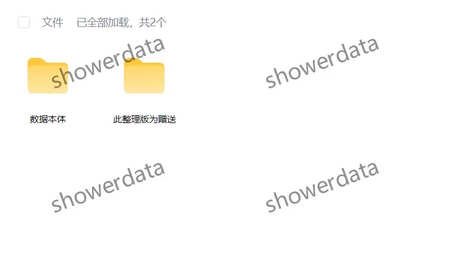
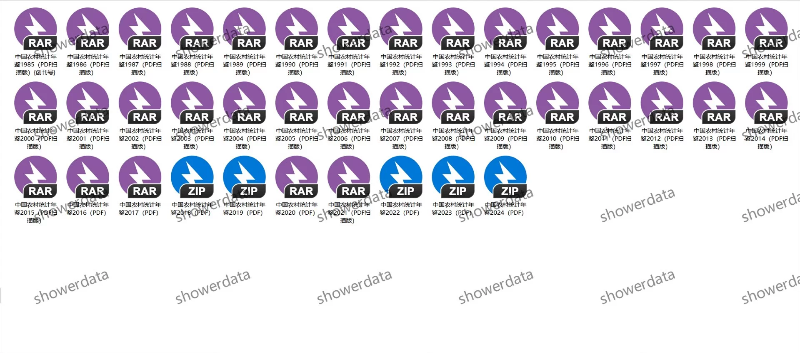
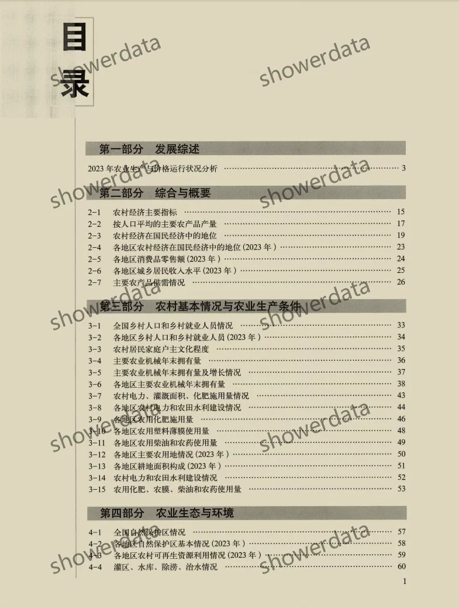
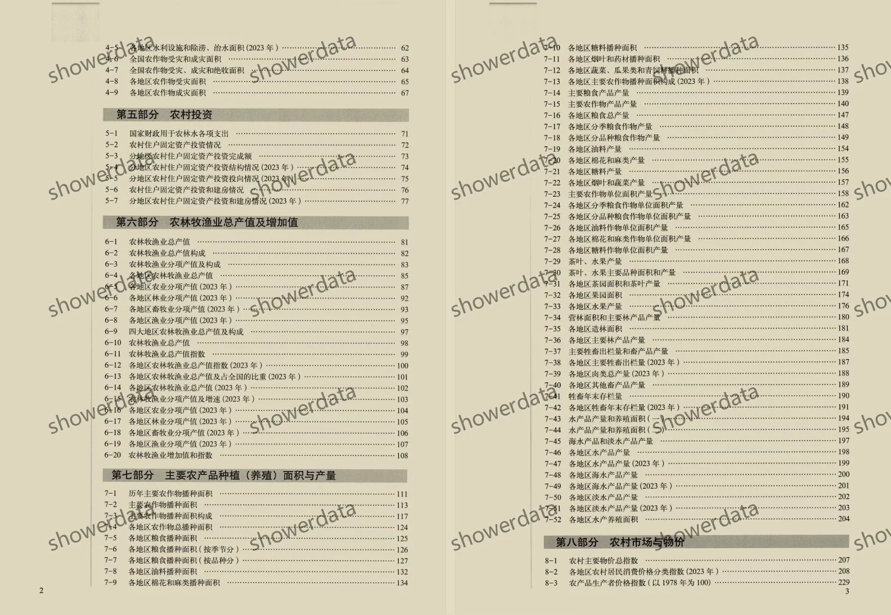
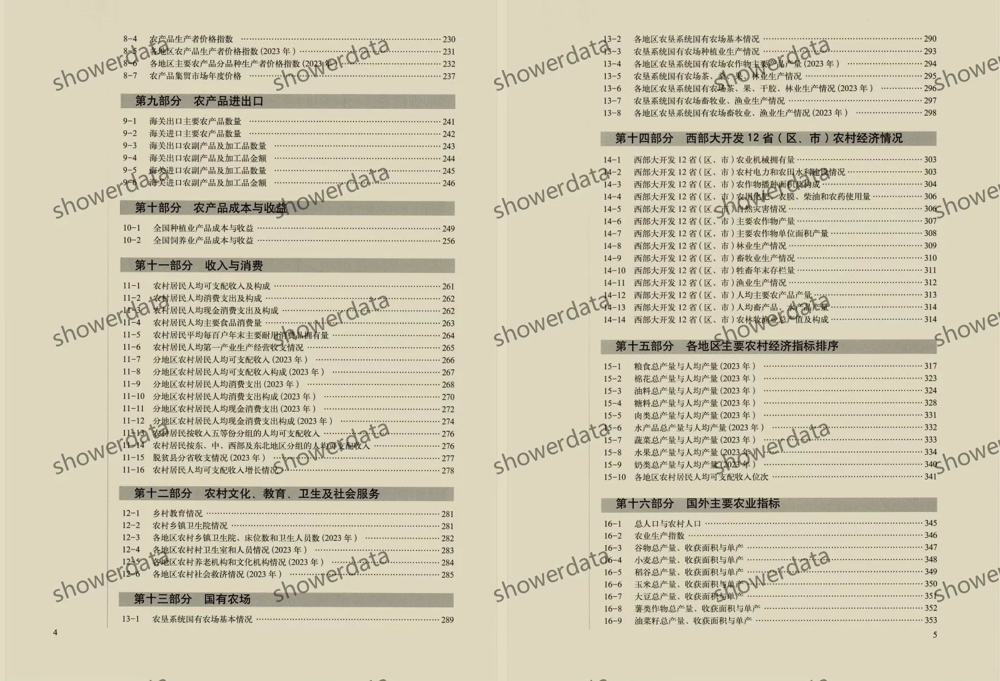
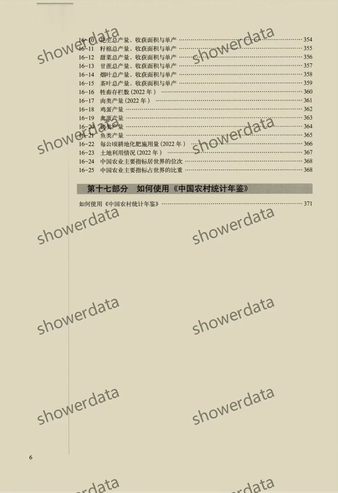

## Body

《China Rural Statistical Yearbook》（1985-2025）

Data Year: The title year is the year of data compilation, and the data year needs to be one less than the title year.
Please review the image below before purchasing! The complete display is provided here, please confirm if it's what you need before purchasing! No returns or exchanges after shipment.

01. Data Introduction
The China Rural Statistical Yearbook

02. Indicator Details
(1) The directory is displayed in the image, please take a look on your own, consider buying based on your needs, and do not help me find the data. All indicators are here, after shipment, there will be no reason for return without refund.
(2) The display directory is for 2024, the length of the text is long, and the different years' statistical standards may change. Academic common sense, the data year recorded in statistical materials is the previous year's data, which is also an academic common sense, please note.
(3) The EXCEL format data is organized from original materials, including the content of the original material data, but not the text content of the original material.
(4) If the data is placed in a zip file, you need to save the zip file first, then download, then unzip.
(5) If there is Excel protection, you can select all and copy to a new sheet to use.

03. Data Format
1985-2024: PDF and Excel
2025: Excel

## Images

item_1070026601515

Here is a pay link on Stripe ( https://buy.stripe.com/3cs8yP7sY87d0vu9AB ). Please contact me lonlonago@foxmail.com after funding $89, and I will send you a complete data files , thank you!

